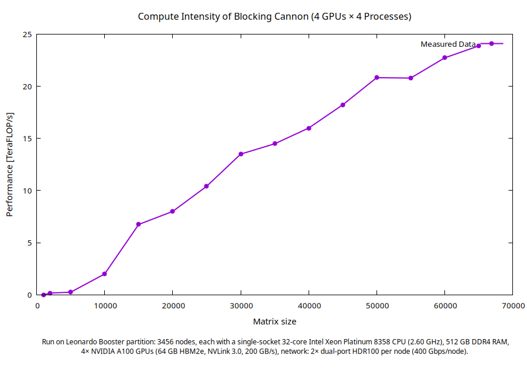

# Parallel Matrix Multiplication using Cannon’s Algorithm (CUDA + MPI)

This project implements a **hybrid MPI + CUDA** version of Cannon’s algorithm for dense matrix multiplication, evaluated on the **Leonardo Booster** partition at CINECA.

---

## 🧩 Overview

Cannon’s algorithm decomposes a square matrix multiplication  
\[
C = A \times B
\]
across an \( N \times N \) MPI process grid. Each MPI rank performs local matrix blocks multiplication and communicates sub-blocks with its neighbors in a toroidal topology.

This implementation offloads each local block multiplication to **NVIDIA A100 GPUs** using CUDA kernels and coordinates inter-process communication with **MPI**.

---

## ⚙️ Code Structure

```
.
├── main.cu                     # Main Cannon’s algorithm (MPI + CUDA)
├── Parallel_CSimple_timer.hpp  # Timing utility (MPI-aware)
├── test.cpp                    # Validation test for correctness
├── compile.job                 # Build script for Leonardo
├── 1node.job                   # Run script (Slurm batch)
├── plot.gp                     # Gnuplot script for performance plot
└── flops.png                   # Final performance plot
```

---

## 🚀 Compilation

Compilation is automated by **`compile.job`**, which loads the proper modules and builds `main.cu` with NVHPC or CUDA + MPI toolchains.  
For manual compilation:

```bash
mpicxx -O3 -std=c++17 -ccbin nvc++ main.cu -o cannon_gpu.x        -I. -lcudart -L${CUDA_HOME}/lib64
```

---

## 🧠 Execution on Leonardo

The provided **`1node.job`** script runs the executable on one Booster node:

```bash
sbatch 1node.job
```

### Leonardo Booster hardware
> **Booster partition (BullSequana X2135 “Da Vinci”):**  
> 3456 nodes, each with a single-socket 32-core **Intel Xeon Platinum 8358** CPU (2.60 GHz),  
> 512 GB DDR4 RAM, **4 × NVIDIA A100 GPUs** (64 GB HBM2e, NVLink 3.0, 200 GB/s),  
> interconnect: **2 × dual-port HDR100** (400 Gb/s per node).

Each rank–GPU pair executes a local matrix block multiplication, and timing is collected via `Parallel_CSimple_timer.hpp` using synchronized MPI barriers to ensure consistent measurements.

---

## 📊 Numerical Experiment

The figure below summarizes the measured performance:



**Figure 1.** Compute intensity (TeraFLOP/s) of Cannon’s algorithm with 4 GPUs × 4 MPI processes on Leonardo Booster.  
Each data point represents the average sustained performance across multiple runs for increasing matrix sizes.

---

## 🔍 Observations

- **Scalability:** Performance increases nearly linearly with matrix size until GPU memory saturation, reflecting efficient overlap of communication and computation.  
- **Peak Performance:** The implementation achieves ≈ 24 TeraFLOP/s on the largest tested matrix, consistent with expected A100 GPU peak performance for double-precision GEMM when distributed across 4 GPUs.  
- **Communication Overhead:** For smaller matrices, performance drops due to startup latency in MPI broadcasts and synchronization phases.  
- **Load Balance:** Uniform block decomposition ensures near-perfect workload distribution across ranks.

---

## 📈 Visualization

Recreate the performance plot with:

```bash
gnuplot plot.gp
```

This produces `flops.png` using data from `times.dat`.

---

## 🧾 References

- Cannon, L.E. *“A Cellular Computer to Implement the Kalman Filter Algorithm.”* PhD Thesis, Montana State University (1969).  
- NVIDIA Developer Blog – *“Scaling Matrix Multiplication across GPUs with CUDA and MPI.”*

---

## 🧰 Acknowledgments

Experiments executed on the **Leonardo Booster** partition at **CINECA** under the ICTP–MHPC program.  
Special thanks to the CINECA support team for maintaining the NVHPC and HPC-X environments.

---
